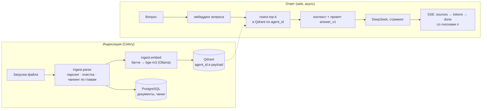

# RAG Agents — экспериментальный RAG-полигон по книгам

**Загрузите книги — задавайте вопросы. Ответы только по вашим документам, с цитатами и ссылками на главу.**

Self-hosted RAG (Retrieval-Augmented Generation) «поиграться и пощупать»: видно каждый шаг — как книга режется на чанки, как выглядят векторы, что нашёл поиск, сколько стоил ответ и насколько он точен по метрикам.

Пользователь создаёт «агента» (например, «Толстой: Война и мир»), загружает в него книги в txt, fb2, epub, pdf или docx и задаёт вопросы. Агент ищет релевантные фрагменты в корпусе, отвечает потоком (SSE) и к каждому утверждению ставит сноску `[n]` на конкретную главу. Если в материалах ответа нет, он так и говорит, а не выдумывает.

> **In English.** A self-hosted RAG service: create an agent, upload books (txt, fb2, epub, pdf, docx) and get streamed answers grounded strictly in that corpus, with chapter-level citations. Own RAG core (no LangChain), FastAPI + HTMX, Celery/RabbitMQ ingest pipeline, Qdrant, `bge-m3` embeddings, DeepSeek LLM, an eval harness with an LLM judge, Langfuse tracing and Prometheus metrics. The UI and docs are in Russian.


*Страница «Под капотом»: вопрос проходит браузер → web → Ollama (эмбеддинг) → Qdrant (поиск) → DeepSeek (генерация) → PostgreSQL и Langfuse. Справа — журнал событий из Redis pub/sub.*

## Зачем это

Обычный чат с LLM на вопрос о книге отвечает «по памяти»: путает детали, выдумывает цитаты и не может сказать, откуда что взял. Здесь модель видит только найденные фрагменты ваших документов и обязана на них ссылаться. Применения:

- **база знаний по своим документам:** регламенты, договоры, техдокументация, конспекты;
- **исследование текстов:** «что Толстой писал о вере», «как менялся князь Андрей» — с точными цитатами;
- **полигон для RAG-инженерии:** каждое изменение поиска, чанкинга или промпта меряется на golden-датасете, а не «на глаз».

Это pet-проект и портфолио: production-подходы (очереди, идемпотентность, DLQ, изоляция данных, наблюдаемость, eval) на реальной задаче. Подробности решений — в [ARCHITECTURE](docs/ARCHITECTURE.md).

## Возможности

- **5 форматов:** txt (UTF-8, cp1251, koi8-r — кодировка определяется сама), fb2 и fb2.zip, epub, pdf с текстовым слоем, docx, до 100 МБ на файл.
- **Структурный чанкинг:** оглавление берётся из файла (TOC, стили, разметка), чанки не пересекают границы глав, у каждого — путь «Том 2 / гл. XII» и номер страницы для PDF.
- **Конвейер индексации на очередях:** parse → embed батчами с фан-аутом, живой прогресс в UI, идемпотентные задачи, ретраи временных ошибок, DLQ и `make dlq-replay`, sweeper застрявших документов.
- **Ответы со сносками и стримингом:** сначала карточки источников со score, затем текст потоком; ссылки `[n]` ведут на фрагмент.
- **Изоляция агентов:** каждый запрос к БД и Qdrant фильтруется по `agent_id`, на чужое — 404 (покрыто интеграционным тестом по всем эндпоинтам).
- **JSON API** с ключами, SSE-стримингом, OpenAPI и ошибками в `application/problem+json` (RFC 9457); rate limit на вопросы, загрузки и вход.
- **Eval-харнесс:** golden-датасет, метрики поиска (hit@k, recall@k, MRR), LLM-судья (faithfulness, answer relevancy, citation support), проверка отказов и prompt injection, сравнение прогонов с bootstrap-доверительным интервалом.
- **Наблюдаемость:** трейсы каждого вопроса и индексации в Langfuse Cloud, стоимость с тарифами peak/off-peak, Prometheus `/metrics`, JSON-логи с `request_id`.
- **«Под капотом»:** живая схема сервисов, карта векторов Qdrant (PCA), очереди, воркеры и состояние хранилищ — понятно, что происходит при каждом действии.

## Скриншоты

**Вопрос агенту.** Ответ со сносками на главы; под ответом — модель, время до первого токена, токены (в т. ч. reasoning), стоимость и ссылка на трейс.


**Карта векторов.** Каждая точка — чанк (1024 измерения → 2 через PCA), цвет — книга. ★ — вектор вопроса, кольца — найденные чанки со score.


**Качество (`/eval`).** Метрики прогона golden-датасета, разбивка по категориям вопросов, граница «есть ответ / нет ответа» и сравнение двух прогонов с 95 % CI.


<table>
<tr>
<td width="50%"><b>Документ:</b> оглавление из файла и чанки с числом токенов и таймингами этапов<br></td>
<td width="50%"><b>Аналитика:</b> стоимость, латентность, где тратится время, последние запросы<br></td>
</tr>
<tr>
<td><b>Агенты</b><br></td>
<td><b>JSON API</b> (OpenAPI, авторизация по ключу)<br></td>
</tr>
</table>

## Как это работает



- **Веб** — FastAPI с серверным рендерингом (Jinja2 + HTMX + SSE), без SPA и node-сборки.
- **Индексация** идёт в фоне через RabbitMQ: в сообщениях только ID, задачи идемпотентны (claim через условный `UPDATE … RETURNING`, детерминированные uuid5 для точек Qdrant), ошибки делятся на временные (ретрай) и постоянные (сразу `failed`), остальное уходит в DLQ.
- **RAG-ядро своё** (парсинг, чанкинг, retrieval, промпты, цитаты) — без LangChain; LlamaIndex планируется только как эталон для сравнения в eval.
- Слои `web/api → services → repositories | rag | llm` проверяются `import-linter`, ORM не выходит за репозитории.

Полное описание: [ARCHITECTURE](docs/ARCHITECTURE.md) (решения, схема БД, контракты, бюджет памяти), [SPEC](docs/SPEC.md) (требования), [PLAN](docs/PLAN.md) (итерации). Обзор со схемами для презентации — [docs/interview/index.html](docs/interview/index.html) (откройте локально в браузере).

## Стек

| Слой | Технологии |
|---|---|
| Язык и сборка | Python 3.12, [uv](https://docs.astral.sh/uv/), src-layout, Docker (multi-stage), Docker Compose |
| Веб и API | FastAPI, Jinja2, HTMX + `htmx-ext-sse`, Bootstrap 5, Pydantic v2, pydantic-settings |
| Данные | PostgreSQL 16 (SQLAlchemy 2.0 async + asyncpg, Alembic), Redis 7 (сессии, rate limit, pub/sub, кэш) |
| Очереди | Celery 5, RabbitMQ 3.13 (очереди `ingest.parse`, `ingest.embed`, `maintenance`, `eval` и их DLQ), Celery beat |
| Поиск | Qdrant 1.19 (dense-векторы, payload-индексы по `agent_id`), `bge-m3` через Ollama (CPU), токенизатор `tokenizers` |
| Парсинг | lxml, selectolax (fb2, epub), PyMuPDF (pdf), python-docx, charset-normalizer, razdel |
| LLM | DeepSeek (OpenAI-совместимый API) со стримингом и reasoning effort |
| Наблюдаемость | Langfuse Cloud (OpenTelemetry), structlog, prometheus_client |
| Качество кода | ruff, mypy `--strict`, import-linter, pytest + pytest-asyncio, respx, polyfactory |

## Системные требования

| | Минимум | Рекомендуется | Комментарий |
|---|---|---|---|
| ОС | Linux x86_64, macOS или Windows с Docker Desktop (WSL2) | Linux | проверено на Ubuntu 22.04 |
| CPU | 4 ядра x86_64 **с AVX** | 6+ ядер | без AVX Ollama в контейнере не запустится — тогда Ollama на хосте (см. ниже); GPU не нужен |
| RAM | 8 ГБ | 12+ ГБ | сумма лимитов контейнеров ≈ 5.9 ГБ, из них 2.5 ГБ — Ollama с `bge-m3`; с Ollama на хосте стенду хватает ≈ 3.4 ГБ |
| Диск | 15 ГБ | 20+ ГБ | образы ≈ 11 ГБ (Ollama — 9.3 ГБ, приложение — 0.7 ГБ), модель `bge-m3` — 1.2 ГБ, плюс индекс: ~330 МБ на 9 000 чанков |
| ПО | Docker Engine 24+ с Compose ≥ 2.24, GNU `make`, `git` | | для разработки — [uv](https://docs.astral.sh/uv/) (Python 3.12 он поставит сам) |
| Сеть | доступ к `api.deepseek.com` | | первый запуск скачивает образы и модель (~12 ГБ) |
| Ключи | [DeepSeek API](https://platform.deepseek.com/) | Langfuse Cloud (бесплатный tier) | Langfuse необязателен: без ключей трейсинг просто выключен |

Порты: UI и API — `8080` (на всех интерфейсах). Qdrant Dashboard (`6333`), RabbitMQ UI (`15672`) и отладочные админки (`5555`, `8081`, `5540`) слушают только `127.0.0.1`; адрес меняется переменной `ADMIN_UI_BIND`.

Скорость на CPU (6 vCPU, без GPU): индексация тома «Войны и мира» (~700 чанков) — 1.5–4.5 минуты, в основном эмбеддинг; ответ на вопрос — 3–5 секунд, первый токен — через ~2.5 секунды. Стоимость ответа DeepSeek — около $0.001.

## Быстрый старт

```bash
git clone https://github.com/Gegirhasut/rag-agents.git
cd rag-agents
cp .env.example .env
```

В `.env` заполните:

- `DEEPSEEK_API_KEY` — ключ DeepSeek;
- `POSTGRES_DB`, `POSTGRES_USER`, `POSTGRES_PASSWORD`, `RABBITMQ_DEFAULT_USER`, `RABBITMQ_DEFAULT_PASS` — любые значения (пароль: `openssl rand -hex 16`);
- `SEED_USER_EMAIL`, `SEED_USER_PASSWORD` — администратор для входа в UI.

```bash
make up      # сборка образа и весь стек; первый запуск скачивает bge-m3 (~1.2 ГБ)
make seed    # создать администратора из SEED_USER_EMAIL / SEED_USER_PASSWORD
```

Откройте <http://localhost:8080>, войдите, нажмите «Создать агента», загрузите книгу и задайте вопрос. Для пробы подойдут файлы из [`tests/fixtures/`](tests/fixtures) (Толстой в разных форматах). Миграции применяет одноразовый сервис `migrate` при каждом `make up`.

Без `make`: `docker compose up -d --build`, затем `docker compose exec web rag-agents user create you@example.com --admin`.

### Где считаются эмбеддинги

По умолчанию (`COMPOSE_PROFILES=local-ollama` в `.env`) Ollama с моделью `bge-m3` поднимается в контейнере. Если Ollama уже стоит на хосте, уберите `COMPOSE_PROFILES` и укажите её адрес в `OLLAMA_BASE_URL`: `http://host.docker.internal:11434` в Docker Desktop, `http://10.0.2.2:11434` из VirtualBox-VM. Так же стоит поступить на CPU без AVX: llama.cpp в контейнере на нём не запустится. Модель на хосте ставится командой `ollama pull bge-m3:567m`.

### Полезные команды

```bash
make help          # все цели
make ps            # состояние сервисов и память
make logs s=web    # логи сервиса (worker-ingest, worker-embed, beat, …)
make up-debug      # + Flower, pgweb, RedisInsight (ссылки — на странице «Под капотом»)
make down          # остановить (данные остаются в volumes)
```

Пользователи: `docker compose exec web rag-agents user create EMAIL [--admin]` (пароль спросит интерактивно), смена пароля — `rag-agents user set-password EMAIL`.

## JSON API

Ключ выпускается в UI на странице «🔑 API-ключи» и показывается один раз (в БД хранится только хэш). Документация — <http://localhost:8080/api/docs>.

```bash
KEY=rag_…
curl -s -H "Authorization: Bearer $KEY" localhost:8080/api/v1/agents
curl -s -H "Authorization: Bearer $KEY" -F files=@book.fb2 localhost:8080/api/v1/agents/$AGENT/documents
curl -N -H "Authorization: Bearer $KEY" -H 'Content-Type: application/json' \
  localhost:8080/api/v1/agents/$AGENT/query -d '{"question": "В чём смысл жизни?", "stream": true}'
```

Со `"stream": true` приходят SSE-события `sources`, `token`…, `done`; без него — один JSON (`chat_id`, `message_id`, `result`). Лимиты: 20 вопросов в минуту на пользователя, 30 загрузок в час, 5 попыток входа в минуту с IP; превышение — `429` с `Retry-After`.

## Качество и наблюдаемость

```bash
make eval AGENT=tolstoi DATASET=tolstoy CONFIG=dense   # прогон golden-датасета → /eval и reports/eval/
make eval-diff A=<run_id> B=<run_id>                   # сравнение двух прогонов, 95 % CI
make metrics                                           # метрики Prometheus стенда
```

Golden-датасет — [`eval/datasets/tolstoy.jsonl`](eval/datasets/tolstoy.jsonl): 59 вопросов по «Войне и миру» и «Исповеди» (факты, интерпретация, multi-hop, вопросы вне корпуса, prompt injection). Текущий baseline (dense-поиск, top-6): **hit@8 0.83 · recall@8 0.79 · MRR@10 0.57 · faithfulness 0.95 · точность отказов 0.93**.

Трейсы: задайте `LANGFUSE_PUBLIC_KEY`, `LANGFUSE_SECRET_KEY`, `LANGFUSE_BASE_URL` в `.env` (без ключей трейсинг выключен, всё остальное работает). Проверка связи — `make langfuse-check`. Страница «📊 Аналитика» считает стоимость и латентность по своей БД, дерево шагов запроса подтягивает из Langfuse. Подробнее — [ARCHITECTURE §14](docs/ARCHITECTURE.md).

Модель и глубина рассуждений настраиваются в `.env`: `LLM_MODEL` (`deepseek-flash`, `deepseek-v4-pro`) и `LLM_REASONING_EFFORT` (`low` / `high` / `max`). После смены: `docker compose up -d web`.

## Разработка

```bash
uv python install 3.12
uv sync --all-extras
make lint          # ruff, ruff format --check, mypy --strict, import-linter
make test-unit     # unit-тесты без docker
make test          # unit + integration на отдельном compose.test.yaml (PG, Redis, Qdrant в tmpfs)
make smoke         # e2e по живому стенду: агент → загрузка → done → вопрос → стрим
```

Правила кода и архитектуры — в [CLAUDE.md](CLAUDE.md), сценарии ручной проверки каждой итерации — в [docs/MANUAL_TESTING.md](docs/MANUAL_TESTING.md).

```
src/rag_agents/
├── core/          # Settings, БД (UoW), Redis, логирование, безопасность
├── domain/        # Pydantic-DTO и enums — контракты между слоями
├── models/        # ORM (только для repositories)
├── repositories/  # доступ к PostgreSQL, наружу — DTO
├── services/      # use cases: агенты, документы, ingest, ответы, auth, eval
├── rag/           # parsing, cleaning, chunking, embeddings, index, retrieval, prompting
├── llm/           # провайдеры LLM, цены
├── web/  api/v1/  # HTML (HTMX) и JSON API
├── workers/       # Celery: очереди, runtime, задачи
└── eval/          # прогоны, метрики, LLM-судья, отчёты
```

## Статус и планы

Сделаны итерации 1–4 из [PLAN](docs/PLAN.md): сквозной скелет, auth и API, production-grade ingest, eval-харнесс с наблюдаемостью. Дальше:

- **5** — гибридный поиск (dense + BM25, RRF), reranker `bge-reranker-v2-m3`, откалиброванный порог отказа, проверка цитат;
- **6** — сравнение своего ядра с LlamaIndex на том же датасете;
- **7** — `LLMRouter`: fallback DeepSeek → Claude / OpenAI / Ollama, circuit breaker, кэш;
- **8** — несколько чатов и агентный режим (MVP); **9** — hardening; **10** — Streamlit и MCP-сервер.

## Лицензии и приватность

| Компонент | Лицензия |
|---|---|
| `bge-m3` (эмбеддинги) | MIT |
| `bge-reranker-v2-m3` (итерация 5) | Apache 2.0 |
| PyMuPDF (парсинг PDF) | AGPL-3.0 — единственное исключение, заменяемо на `pypdfium2` |
| Остальные библиотеки | MIT / BSD / Apache 2.0 |

В проекте используются только модели, допускающие коммерческое использование. NC-лицензии (например, `jina-reranker-v2`) не берём.

**Приватность.** Эмбеддинги считаются локально, но найденные фрагменты документов вместе с вопросом уходят во внешний LLM (DeepSeek). Для закрытых корпусов используйте провайдера, которому доверяете (`LLM_BASE_URL` принимает любой OpenAI-совместимый API, в том числе локальный).

Код проекта распространяется по лицензии [MIT](LICENSE).
